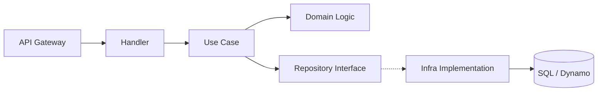

# Arquitectura Hexagonal y DDD en Serverless

Esta arquitectura tiene como objetivo principal el **desacoplamiento total** de la lógica de negocio de los detalles técnicos de la infraestructura (AWS, bases de datos, librerías externas).

## 1. El Dominio (Domain)
Ubicación: `src/modules/{modulo}/domain`

Es la capa más interna. Aquí no se permite ningún `import` de librerías de AWS o de terceros (exceptuando quizás utilidades muy básicas).
*   **Models**: Entidades de negocio (clases o interfaces) que representan los conceptos del ERP (Sale, Product, Invoice).
*   **Repository Interfaces**: Los "Puertos". Definen qué acciones se pueden hacer sobre la base de datos sin especificar cómo se hacen.
*   **Exceptions**: Errores propios del negocio (ej: `InsufficientStockError`).

## 2. La Aplicación (Application)
Ubicación: `src/modules/{modulo}/application`

Contiene los **Casos de Uso**. Es el director de orquesta.
*   Toma la entrada de un Handler.
*   Utiliza el Repositorio (vía interfaz) para cargar/guardar datos.
*   Aplica las reglas de negocio del Dominio.
*   **No conoce** si está corriendo en un Lambda o en un contenedor.

## 3. Infraestructura (Infrastructure)
Ubicación: `src/modules/{modulo}/infrastructure`

Aquí se implementan los "Adaptadores Secundarios".
*   **Repositories**: Implementaciones reales de las interfaces (DynamoDB, SQL Server).
*   **Clients**: Clientes para APIs externas.
*   **Database Helpers**: Lógica de conexión y pools (como el `database.ts` que creamos).

## 4. Handlers (Adapters)
Ubicación: `src/handlers/{modulo}`

Son los "Adaptadores Primarios".
*   Es el punto de entrada de AWS Lambda.
*   Limpia el evento (API Gateway, SQS, etc).
*   **Inyección de Dependencias**: Aquí es donde se instancia el Repositorio concreto (Dynamo o SQL) y se pasa al Caso de Uso.

---

## 🎨 Diagrama de Flujo

