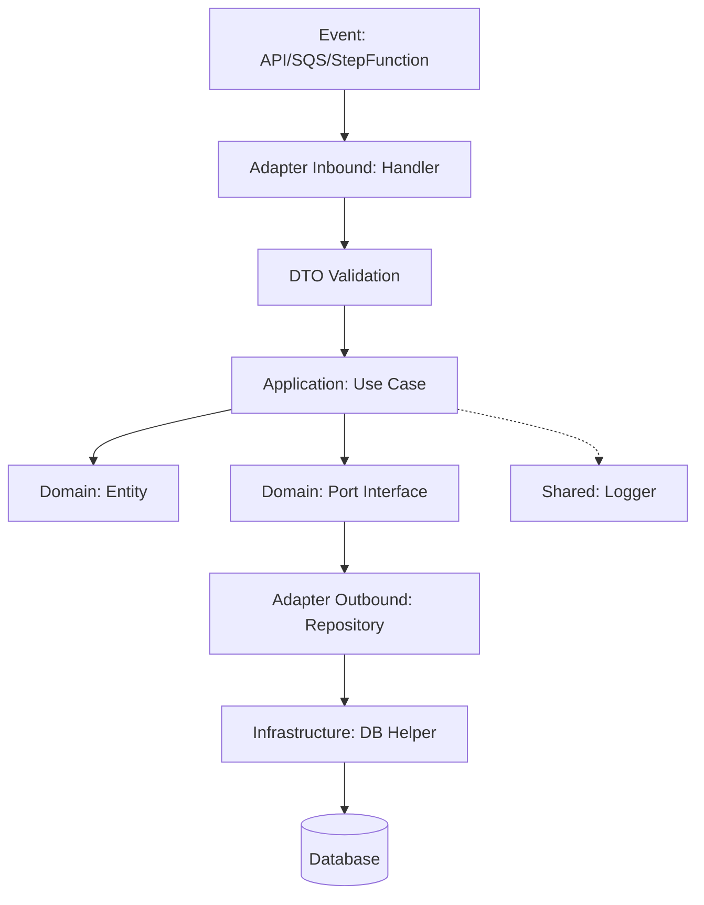

# Arquitectura Hexagonal Granular (Ports & Adapters)

Esta arquitectura separa el sistema en capas con responsabilidades claras, ideal para un ERP de gran escala.

## 1. Domain (Núcleo)
Ubicación: `src/modules/{modulo}/domain`

Es la lógica pura del negocio.
*   **Entities**: Modelos de datos de negocio (`Sale`, `Product`).
*   **Ports**: Interfaces que definen los contratos para el mundo exterior (`ISaleRepository`).

## 2. Application (Casos de Uso)
Ubicación: `src/modules/{modulo}/application`

Orquesta el dominio para cumplir los objetivos del sistema.
*   **Use Cases**: Clases que implementan la lógica de un proceso (ej: `CreateSaleUseCase`). Reciben inputs tipados y coordinan entidades y puertos.

## 3. Adapters (Traducción)
Ubicación: `src/modules/{modulo}/adapters`

### Inbound (Entrada)
*   **Handlers**: Lambda functions que reciben eventos de AWS.
*   **DTOs & Validation**: Validan el input antes de llamar a la aplicación.

### Outbound (Salida)
*   **Repositories**: Implementaciones técnicas de los puertos (DynamoDB, SQL Server).

## 4. Infrastructure (Tecnología)
Ubicación: `src/modules/{modulo}/infrastructure`

Herramientas técnicas específicas del módulo, como el cliente de conexión a base de datos o helpers de pooling.

## 5. Shared (Transversal)
Ubicación: `src/shared`

Código técnico no relacionado con el negocio que se reutiliza en todo el ERP (Logger, Middleware de Errores, Clientes de Eventos).

---

## 🎨 Diagrama del Refactor Maestro

